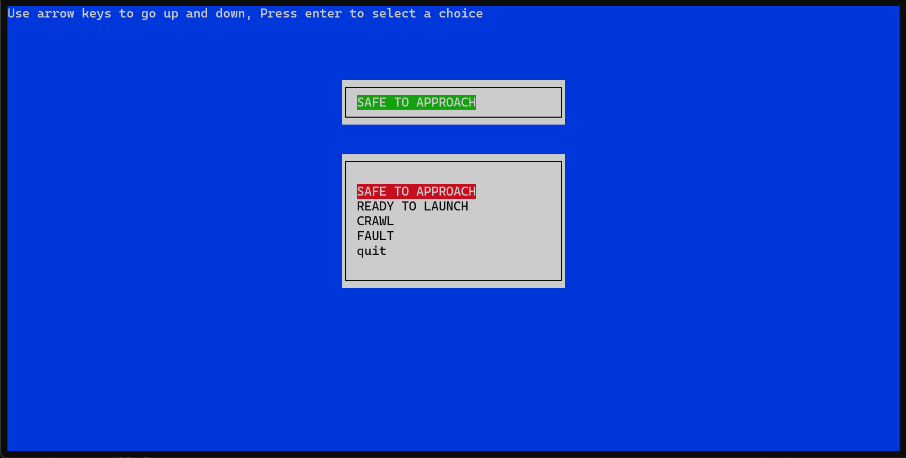

# Onboarding

Basic implementation of the Alberta Loop FSM.

## Features

- Locking semaphore for multitask systems
- cross-platform UI w/ ncurses
- Logging to file



## Logging

Logs are updated in the file `state.log`, assuming it exists.

### Example log output

```
[Sat Sep 27 17:39:56 2025] READY TO LAUNCH
[Sat Sep 27 17:40:02 2025] CRAWL
[Sat Sep 27 17:40:03 2025] Invalid state transition attempted, entering FAULT state
[Sat Sep 27 17:40:03 2025] FAULT```
